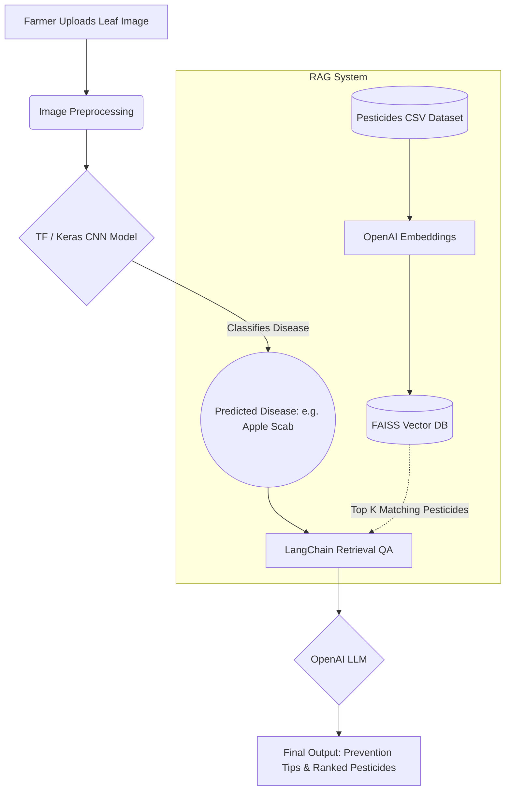

# AgriWorld ML Pipeline Documentation

## Overview

AgriWorld's ML pipeline is designed to assist farmers by identifying plant diseases from leaf imagery and instantly suggesting the most effective pesticides. 
It combines **Computer Vision** for disease detection with **Retrieval-Augmented Generation (RAG)** to provide conversational and context-aware agricultural advice.

## Pipeline Architecture

The end-to-end pipeline operates in three main stages:

1. **Image Upload & Preprocessing:** The farmer uploads an image of a diseased crop leaf.
2. **Convolutional Neural Network (CNN):** A MobileNetV2 architecture processes the image array and outputs a predicted disease class (e.g., *Tomato - Late Blight*).
3. **Pesticide RAG Engine:** The predicted disease is passed to a LangChain framework. It queries a FAISS Vector Database built from our `pesticides_dataset.csv` using OpenAI Embeddings. The top matches are sent to an LLM, generating a ranked list of pesticides and prevention tips.

### System Diagram

## Dataset Specifications

### 1. Plant Village Dataset
- Used for training the CNN model.
- Contains thousands of images classified by plant species and disease state. Data is augmented for robustness.

### 2. Dummy Pesticide Dataset
Since no direct database mapping disease to pesticide existed in your initial scope, a dummy structured file (`pesticides_dataset.csv`) was created to run the LangChain query. It features:
- **Disease_Name**: Targeted specific plant pathogen combination.
- **Pesticide_Name**: Name of the chemical or organic spray.
- **Active_Ingredient**: The root chemical structure targeting the fungus/bacteria.
- **Effectiveness_Rating & Safety_Rating**: Used by the LLM to Rank recommendations.
- **Application_Method & Prevention_Tips**: Fed into the LLM context so the agent can teach the farmer best practices.

## Tools & Libraries Used
- **TensorFlow / Keras**: Handles MobileNetV2 operations.
- **Pandas**: Manages the unstructured ingestion of the CSV.
- **LangChain & VectorStores (FAISS)**: Framework linking vector retrieval with the OpenAI prompt generation.